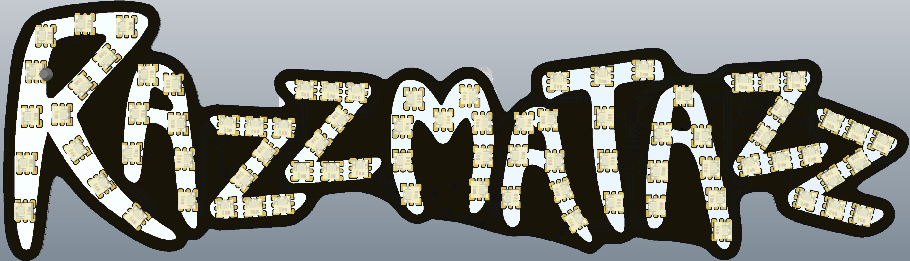
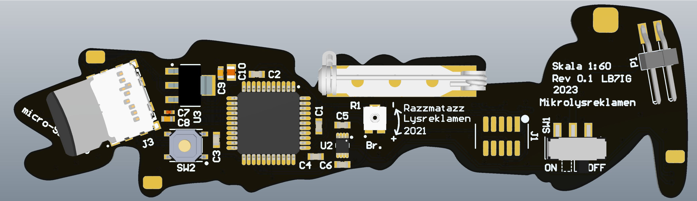

# Mikrolysreklamen21

Mikrolysreklamen is a 1:60 scale version of the large illuminated advertising sign of the name of UKA. The LEDs used are 2x2mm fully addressable APA102 RGB LEDs, they are not fully to scale as the real sign has 50mm diameter bulbs, which in 1:60 would be 0.8mm diameter.
